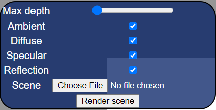
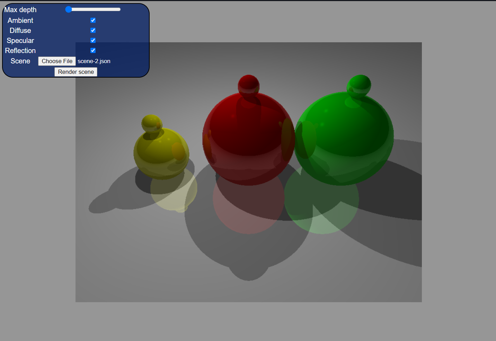

# CS425 - Computer Graphics I (Spring 2021)

## Description
You interact with the program via the main panel shown bellow.

The different checkmarks turn on and off different parts of the rendering sequence. Ambient is overall color, diffuse is surface shading, specular adds the specular component of ligth reflection, and reflection toggles on and off surface reflections. The JSON file input is where you input the file defining the scene. Make sure to use scene-2. An example of it working is bellow.

## Methods Implemented
The main methods that had to be implemented are raySphereIntersection which determines if between a ray from the camera and the object, rayPlaneIntersection which does the same thing but for planes, intersectObjects which takes in a ray and finds the closest intersection to that ray and makes a hit object out of that, shade which handles the ambient, diffuse, specular, and reflection shading for the objects, and then isInShadow which determines if an object is within a shadow or not.
